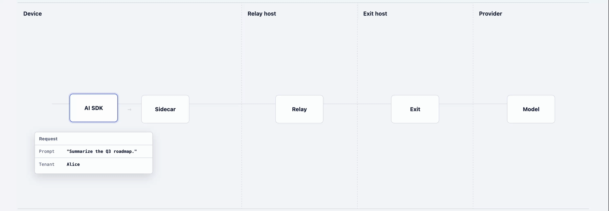

# Shallot

_Onion routing for your AI gateway_



Shallot is a proof-of-concept AI gateway split in two so that no single service sees both who sent a prompt and what it says. It exposes an OpenAI Chat Completions endpoint that works with the Vercel AI SDK.

The client sidecar encrypts requests to the Exit. The Relay authenticates the tenant and forwards the opaque request. The Exit decrypts and sanitizes it, calls a configured AI provider, and encrypts padded response frames back to the sidecar.

## Test it

The complete test suite uses a deterministic local provider. It needs no API key, external service, or paid model.

```sh
bun install --frozen-lockfile
bun run check
```

The end-to-end tests use the real `ai` and `@ai-sdk/openai-compatible` packages over HTTP:

```sh
bun run test:e2e
```

The Sidecar, Relay, Exit, and mock provider run on Effect 4 RC and
`@effect/platform-bun`. Effect owns each HTTP server, request fiber,
configuration, service graph, error channel, tracing span, interruption, and
server scope. Fetch requests, responses, abort signals, and Web Streams remain
the adapters at the protocol and AI SDK boundaries.

The protocol package has no Effect dependency. Its HPKE operations, wire
validators, padding, framing, and bounded body reader remain independent.

## Run the local stack

Start all four services with local development credentials and readable debug
logs. Each line has a color-coded service prefix:

```sh
bun run dev:local
```

The command creates `.shallot/keys` when needed and stops every service when it
receives Ctrl-C. The individual commands are below for debugging one process at a
time.

To debug all four processes in VS Code, install the workspace's recommended
extensions:

- Effect Dev Tools (`effectful-tech.effect-vscode`)
- TypeScript 7 (`TypeScriptTeam.native-preview`)
- Bun for Visual Studio Code (`oven.bun-vscode`)

The Bun extension provides the JavaScript debugger used for breakpoints,
stepping, and variable inspection. Effect Dev Tools does not replace that
debugger. It connects to the running Effect runtime and shows fibers, Context,
span stacks, and defects. The TypeScript 7 extension enables the patched Effect
language service, which adds Effect-specific diagnostics and editor hints.

After `bun install`, reload VS Code and run `TypeScript: Enable TypeScript 7`
from the command palette. Open the Effect Dev Tools panel and select `Start the
server`, then start the inspector-enabled stack:

```sh
bun run dev:debug
```

This command enables the Effect DevTools client and raises the Sidecar, Relay,
and provider deadlines to ten minutes so requests can remain paused at
breakpoints. Explicit timeout environment values override the debug defaults.

Open Run and Debug, select `Attach: Local Shallot stack`, and press F5. The
compound configuration attaches to Provider, Exit, Relay, and Sidecar. Set
breakpoints before sending a request to `http://127.0.0.1:8788/v1`.

Send a request through the stack from another terminal:

```sh
curl http://127.0.0.1:8788/v1/chat/completions \
  -H "Authorization: Bearer tenant-local" \
  -H "Content-Type: application/json" \
  -d '{
    "model": "mock-text",
    "messages": [
      {
        "role": "user",
        "content": "Hello from the Sidecar"
      }
    ]
  }'
```

Effect Dev Tools shows the paused fiber's Context, span stack, and sibling
fibers, but the Bun debugger controls execution. Use Continue to move between
breakpoints in different services. Step Over cannot cross an HTTP request
because each service runs in a separate Bun process.

Generate an X25519 Exit key pair. The private file is created with mode `0600`, is ignored by Git, and is never printed.

```sh
bun run keygen
```

Start each trust domain in a separate terminal from the repository root:

```sh
MOCK_PROVIDER_API_KEY=provider-local bun packages/mock-provider/src/main.ts
```

```sh
EXIT_PRIVATE_KEY="$(<.shallot/keys/exit-private.key)" \
EXIT_RELAY_TOKEN=relay-to-exit-local \
LLM_PROVIDER_URL=http://127.0.0.1:8785/v1/chat/completions \
LLM_PROVIDER_API_KEY=provider-local \
bun packages/exit/src/main.ts
```

```sh
RELAY_TENANT_TOKENS=demo:tenant-local \
RELAY_EXIT_TOKEN=relay-to-exit-local \
bun packages/relay/src/main.ts
```

```sh
SIDECAR_EXIT_PUBLIC_KEY="$(<.shallot/keys/exit-public.key)" \
bun packages/client/src/main.ts
```

Exit depends on an `LlmProvider` interface. The executable constructs the
included OpenAI-compatible adapter from `LLM_PROVIDER_URL`,
`LLM_PROVIDER_API_KEY`, `LLM_PROVIDER_TIMEOUT_MS`, `LLM_ALLOWED_MODELS`, and
`LLM_MAX_RESPONSE_BYTES`. The local stack points that adapter at the mock
provider by default; setting `LLM_PROVIDER_URL` replaces that destination.

Point an OpenAI-compatible AI SDK provider at the sidecar:

```ts
import { createOpenAICompatible } from "@ai-sdk/openai-compatible";
import { generateText } from "ai";

const shallot = createOpenAICompatible({
  name: "shallot",
  baseURL: "http://127.0.0.1:8788/v1",
  apiKey: "tenant-local",
});

const result = await generateText({
  model: shallot.chatModel("mock-text"),
  prompt: "Say hello",
});
```

### Debug each machine's view

Set `SHALLOT_LOG_LEVEL=debug` on a process to print a labeled event followed by
its indented data. Relay logs identify the tenant but mark the prompt and answer
as encrypted. Exit and the provider log plaintext content with the tenant set to
`unknown`. Sidecar logs both plaintext directions on the client machine.

Debug logs intentionally contain prompt and response text on machines allowed to
read it. Do not enable them in production or send them to a shared log service.

## Security boundary

The privacy property requires the Relay and Exit not to collude. The Relay learns tenant identity and traffic metadata. The Exit and upstream provider see the sanitized plaintext request, and the provider sees requests as coming from the Exit. If Relay and Exit records are combined, or timing is correlated, they can associate a tenant with a request.

Shallot uses RFC 9180 HPKE with X25519/HKDF-SHA-256, HKDF-SHA-256, and AES-256-GCM. The static Exit recipient key does not provide forward secrecy if that private key is later compromised. This POC is not a substitute for an independent security review.

Open the [animated request flow](docs/flow.html) for a visual walkthrough. See [the security model](docs/security.md) for precise guarantees and limitations, and [the implementation plan](docs/implementation-plan.md) for design detail.

See [the separate-machine runbook](docs/separate-machines.md) to place Sidecar,
Relay, and Exit on different hosts using restricted SSH tunnels.
